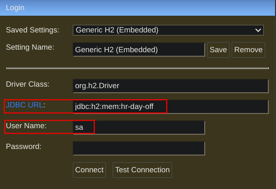
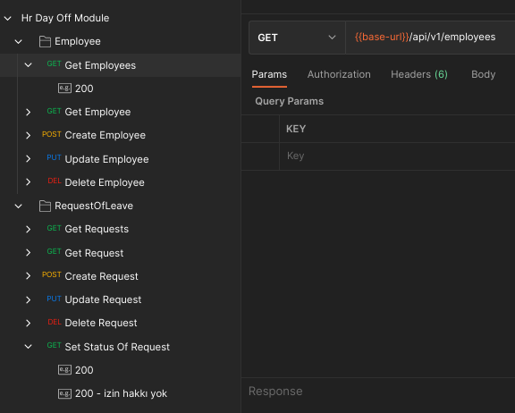
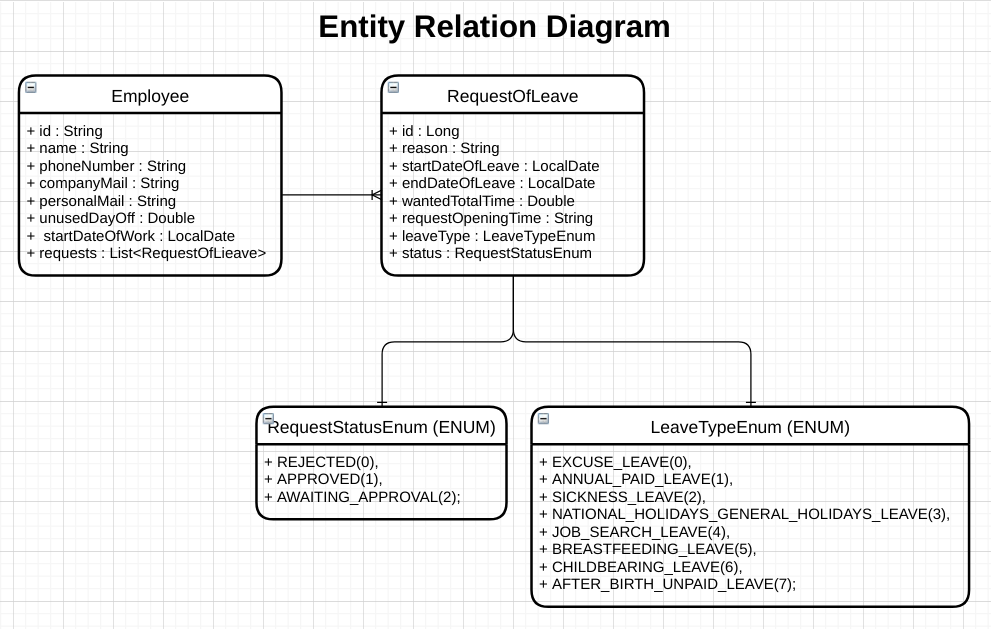

 

# Requirements

Backend Requirements

* JDK 8 http://jdk.java.net/java-se-ri/8-MR3 (OpenJDK)
* Maven https://maven.apache.org/download.cgi
    

---

Requirements Setup For GNU/Linux:
--

1.You can use package manager:

Java:

    $ sudo apt-get update \
    && sudo apt-get install openjdk-8-jdk \
    && java -version

Maven:

    $ sudo apt install maven \
    && mvn -version

2.Manuel Setup:

* Get JDK And Maven compressed files.

* Then extract.

* Give name without space to files. (Java File: OpenJDK-8 | Maven: Maven)

* Then move files to any where permanently.

* Last thing you should set PATH and ENVIRONMENT VARIABLE:

    * Open terminal and open .bashrc file with any editor for edit this file. (I choose gedit for this example)

            $ gedit .bashrc

    * And then add this lines.        

    Maven:

        export M2_HOME=/${PATH}/${MAVEN-MAIN-DIRECTORY}
        export PATH=$M2_HOME/bin:$PATH

    Java:        

        export JAVA_HOME=/${PATH}/${JAVA-MAIN-DIRECTORY}
        export PATH=$JAVA_HOME/bin:$PATH

# Build And Run Application

## 1. Packaging:
* Get application source code with Git. (You should have git program for run this command or you can just download source code from browser)

        $ git clone https://github.com/erensayar/HrDayOffModule.git
        $ cd ToDoApp

* Compilation and build with maven.
    
        $ mvn package
    
* Now we have a jar file.

        java -jar target/hr-day-off-module.jar
        
## 2. Use Wrappers
Also you can use maven wrapper for run the app.(mvnw or mvnw.cmd)

If you don't want setups, you can use wrapper. Easiest way run the spring application.

    $ mvn spring-boot:run

# Default Application Configurations

* Server Port : <b>8000</b>
* Swagger Directory : /swagger-ui.html
* H2 Console Directory : /h2-console/login
* H2 Console Configurations:
    * User Name: sa
    * Datasource.url: jdbc:h2:mem:hr-day-off

    

# I Prepared Collection With Saved Request & Saved Responses
* You can use swagger of course but if you want use postman or something u can import this collection.

* You can find collection for test the api. This collection include saved request and response and all endpoints. 

* If employee id need for send to endpoint take the employee id from an employee service! Id numbers are unique.

Directory: dev-doc > Hr Day Off Module.postman_collection.json 

Some Requests:

# Entity Relation Diagram (ERD)

